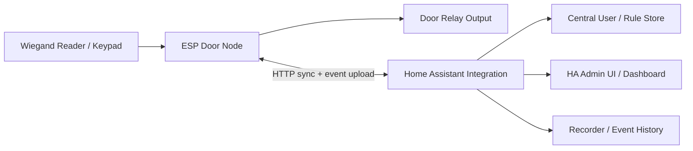

# ESP-RFID V3 Architecture

## Systemoversigt



## Ansvarsfordeling

### ESP Door Node

- indlæser lokal snapshot-cache
- modtager Wiegand events
- matcher credential + eventuelt PIN mod lokal cache
- afgør adgang lokalt
- styrer relæoutput
- uploader events, health og versionsinfo til HA
- modtager nye snapshots og kommandoer fra HA

### Home Assistant Integration

- ejer bruger- og regeldomænet
- genererer snapshots per dørnode
- holder styr på device-status og seneste sync
- viser status og historik i HA
- udsender kommandoer som `pulse_unlock`, `hold_unlock`, `cancel_hold`, `resync`

## Device Model

Hver ESP-repræsenteret dørnode har:

- `device_id`
- `door_name`
- `door_mode`
- `relay_mode`
- `reader_mode`
- `snapshot_version`
- `last_seen`
- `last_sync_at`
- `health_state`
- `firmware_version`

## Relay Model

Hver node har én fysisk dørkanal.

Dørkanalen skal kunne konfigureres med:

- aktiv høj eller aktiv lav relælogik
- standard unlock-puls i millisekunder
- om `hold_unlock` er tilladt
- fail-safe eller fail-secure semantik til statusvisning i HA

Foreslåede runtime-tilstande:

- `locked`
- `pulse_active`
- `hold_active`
- `degraded`

## Access Model

Hver bruger kan have:

- navn
- aktiv/inaktiv
- credential-list
- PIN-policy
- gyldighedsperiode
- adgang per dør
- adgangsvinduer per dør

Hver credential kan være:

- RFID tag
- PIN
- kombineret tag + PIN

## Lokalt Snapshot

ESP’en arbejder kun på et kompakt snapshot for sin egen dør.

Snapshot indeholder:

- dørkonfiguration
- liste over aktive brugere for netop den dør
- credential records
- adgangsregler
- policy-version
- udløbstid for snapshot

Snapshot må være optimeret til hurtig lookup og lav RAM-brug. HA kan have en rigere intern model end den, der sendes til device.

## Foreslået Sync-Protokol

V3 bør bruge enkel HTTP over det lokale netværk i stedet for en tung async-MQTT-stack.

### Device -> HA

- `POST /api/esp_rfid_v3/devices/{device_id}/events`
- `POST /api/esp_rfid_v3/devices/{device_id}/heartbeat`
- `GET /api/esp_rfid_v3/devices/{device_id}/snapshot?version=N`

### HA -> Device

HA kan enten:

- lade device polle efter snapshots og kommandoer
- eller kalde device-endpoints direkte ved behov

På ESP-siden giver disse endpoints mening:

- `GET /v1/status`
- `POST /v1/command/pulse_unlock`
- `POST /v1/command/hold_unlock`
- `POST /v1/command/cancel_hold`
- `POST /v1/snapshot`
- `POST /v1/recovery/bootstrap`

## Adgangsflow

### Normal lokal adgang

1. Reader afleverer credential-event
2. Node parser Wiegand-data
3. Node slår credential op i lokal snapshot-cache
4. Node vurderer tidsregel, dørregel og PIN-krav
5. Node styrer relæ
6. Node gemmer event lokalt
7. Node uploader event til HA, når muligt

### Hold-open fra HA

1. Administrator aktiverer hold-open i HA
2. HA sender device-kommando eller markerer pending command
3. Node aktiverer relæ i hold-mode
4. HA eller administrator ophæver hold-open
5. Node slipper relæet

## Offline Fallback

Hvis HA er utilgængelig:

- sidste gyldige snapshot bruges videre
- events lægges i lokal kø
- manuelle lokale admin-funktioner er stærkt begrænsede
- device må aldrig skifte til "allow all"

Hvis snapshot er for gammelt:

- systemet skal fortsat kunne køre i en kontrolleret grace-periode
- derefter skal policy kunne markere tilstanden som `degraded`, men stadig følge sidste kendte regler

## HA-Side Brugeroplevelse

HA bør tilbyde:

- fælles brugeroversigt
- adgangsmatrix per dør
- live status per dør
- services til unlock og hold-open
- audit-log med filtrering per dør og bruger

### Foreslåede HA-entiteter per dør

- `lock.<door_name>`
- `binary_sensor.<door_name>_online`
- `binary_sensor.<door_name>_degraded`
- `sensor.<door_name>_snapshot_version`
- `sensor.<door_name>_event_queue_depth`
- `sensor.<door_name>_last_sync`
- `button.<door_name>_resync`
- `button.<door_name>_reboot`

## Firmware-Module Proposal

```text
firmware/
  app/
    main.cpp
  core/
    AccessEngine.*
    SnapshotStore.*
    EventQueue.*
    RelayController.*
    WiegandParser.*
    SyncClient.*
    RecoveryServer.*
    Security.*
```

## Home Assistant Module Proposal

```text
custom_components/esp_rfid_v3/
  __init__.py
  manifest.json
  config_flow.py
  coordinator.py
  api.py
  storage.py
  services.yaml
  button.py
  binary_sensor.py
  lock.py
  sensor.py
  diagnostics.py
  panel/
```

## Designvalg Jeg Vil Anbefale

- 1 node = 1 dør
- central brugerbase i HA
- lokal snapshot-cache på device
- HTTP-baseret sync
- recovery-UI kun til nødbrug
- ingen almindelig brugeradministration direkte på ESP’en
